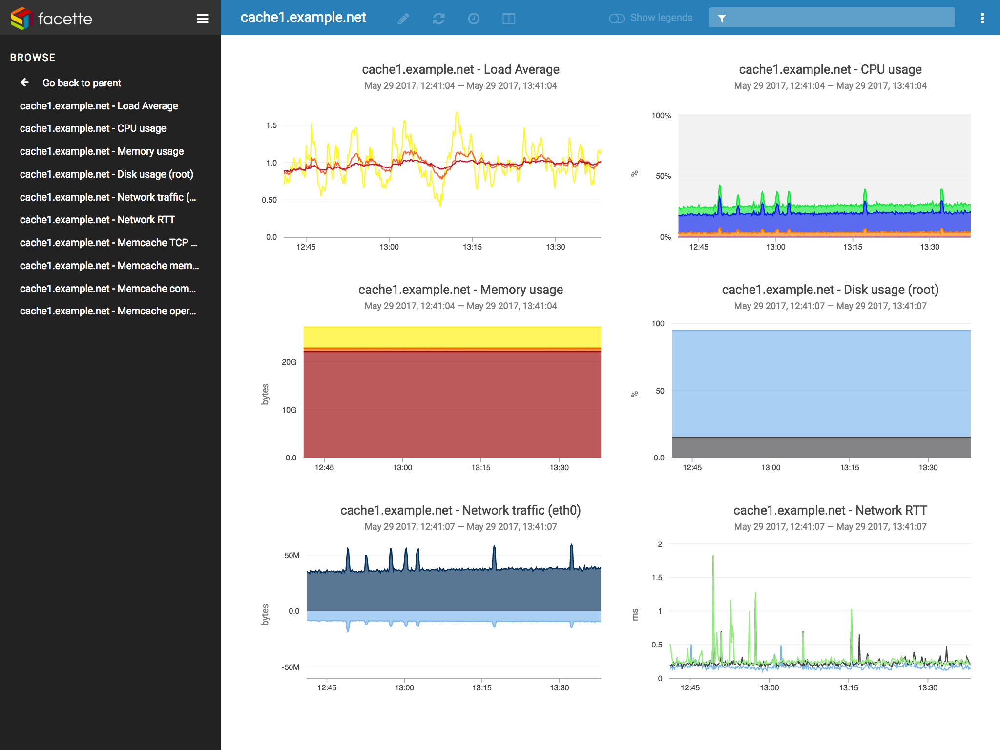

<!--
Ohart ongi: README hau automatikoki sortu da <https://github.com/YunoHost/apps/tree/master/tools/readme_generator>ri esker
EZ editatu eskuz.
-->

# Facette YunoHost-erako

[](https://dash.yunohost.org/appci/app/facette)  

[](https://install-app.yunohost.org/?app=facette)

*[Irakurri README hau beste hizkuntzatan.](./ALL_README.md)*

> *Pakete honek Facette YunoHost zerbitzari batean azkar eta zailtasunik gabe instalatzea ahalbidetzen dizu.*  
> *YunoHost ez baduzu, kontsultatu [gida](https://yunohost.org/install) nola instalatu ikasteko.*

## Aurreikuspena

Facette is a web application to display time series data from various sources — such as collectd, Graphite, InfluxDB or KairosDB — on graphs, designed to be easy to setup and to use.

**Paketatutako bertsioa:** 0.5.1~ynh4

**Demoa:** <https://play.facette.io/browse/>

## Pantaila-argazkiak



## :red_circle: Ezaugarri zalantzagarriak

- **Jatorrizko garapena utzita**: Software honek ez du arduradunik. Denborak aurrera egin ahala funtzionatzeari utziko dio, konpondu gabeko segurtasun arazoak izango ditu, etab.

## Dokumentazioa eta baliabideak

- Aplikazioaren webgune ofiziala: <https://facette.io/>
- Administratzaileen dokumentazio ofiziala: <https://docs.facette.io/>
- Jatorrizko aplikazioaren kode-gordailua: <https://github.com/facette/facette>
- YunoHost Denda: <https://apps.yunohost.org/app/facette>
- Eman errore baten berri: <https://github.com/YunoHost-Apps/facette_ynh/issues>

## Garatzaileentzako informazioa

Bidali `pull request`a [`testing` abarrera](https://github.com/YunoHost-Apps/facette_ynh/tree/testing).

`testing` abarra probatzeko, ondorengoa egin:

```bash
sudo yunohost app install https://github.com/YunoHost-Apps/facette_ynh/tree/testing --debug
edo
sudo yunohost app upgrade facette -u https://github.com/YunoHost-Apps/facette_ynh/tree/testing --debug
```

**Informazio gehiago aplikazioaren paketatzeari buruz:** <https://yunohost.org/packaging_apps>
